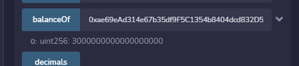
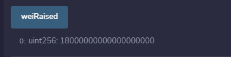

# ERC-20 Token and Crowdsale

Fungible token that is ERC-20 compliant and that minted by using a `Crowdsale` contract from the OpenZeppelin Solidity library.

The crowdsale contract manages the entire crowdsale process, allowing users to send ether to the contract and in return receive KAI, or KaseiCoin tokens. Your contract will mint the tokens automatically and distribute them to buyers in one transaction.

## Technology 

* [Remix IDE](https://remix.ethereum.org/) - to run Solidity code and deploy contracts
* [Ganache](https://github.com/trufflesuite/ganache) - to run transactions on local Blockchain 
* [MetaMask](https://metamask.io/) - as a wallet to link the contract to the local blockchain

## Usage

Upload .sol files into Remix IDE, compile and deploy. 

Deployer contract should be deployed using local test account.

Crowdsale and token contracts should be deployed using the At Address function and the contract addresses created by the deployer contract.

## Compiled Contracts

KaseiCoin Compiled

Crowdsale and Deployer compiled

## Deployed

The contract is deployed on a local test blockchain using Ganache and MetaMask.

## Tested

Using the deployed contract, some test purchases and balance checks were completed.

Transaction 1, buying 3 Ether of KaseiCoins.

Balance check of test 1 account:

Transaction 2 buying 15 Ether of KaseiCoins.

Balance check of test 2 account:

Total Supply of KaseiCoins:

Wei raised in contract:

